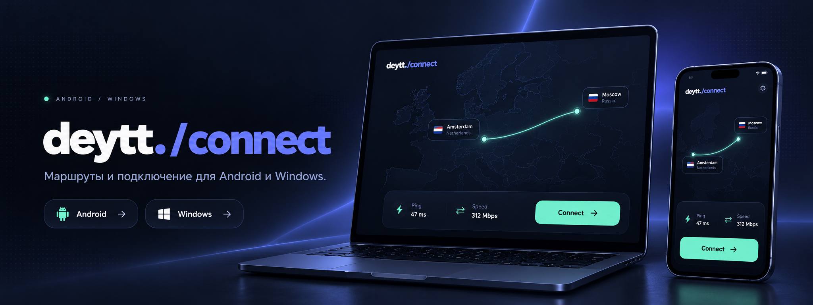
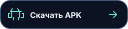

<div align="center">
  
</div>

<p align="center"><a href="#скачать-приложение"></a> &nbsp; <a href="#как-начать"></a> &nbsp; <a href="#возможности"></a> &nbsp; <a href="#поддержка"></a></p>

<h3 align="center">скачать приложение</h3>

<table width="100%" align="center" style="width:100%;table-layout:fixed;">
  <tbody>
    <tr>
      <td width="50%" align="center" valign="top">
        <h4>android</h4>
        <p><sub>v0.8.30 &nbsp;·&nbsp; android 7+ &nbsp;·&nbsp; ARM64</sub></p>
        <p><a href="https://github.com/crxwov/deytt.connect/releases/download/v0.8.30/deytt-connect-0.8.30.apk"></a></p>
        <p><sub><a href="https://github.com/crxwov/deytt.connect/releases/tag/v0.8.30">релиз и SHA-256</a><br>приложения нет в google play</sub></p>
      </td>
      <td width="50%" align="center" valign="top">
        <h4>windows</h4>
        <p><sub>v0.8.40 &nbsp;·&nbsp; windows 10 (1809+) &nbsp;·&nbsp; x64</sub></p>
        <p><a href="https://github.com/crxwov/deytt.connect/releases/tag/v0.8.40"></a></p>
        <p><sub><a href="https://github.com/crxwov/deytt.connect/releases/download/v0.8.40/deytt-connect-0.8.40-portable.zip">portable ZIP</a> &nbsp;·&nbsp; <a href="https://github.com/crxwov/deytt.connect/releases/tag/v0.8.40">SHA-256 и релиз</a><br>сборки не подписаны</sub></p>
      </td>
    </tr>
  </tbody>
</table>

<table width="100%" align="center" style="width:100%;table-layout:fixed;">
  <tbody>
    <tr>
      <td width="50%" align="center" valign="top"><sub>доступ</sub><br>получите его через <a href="https://t.me/deyttbot">telegram-бот</a></td>
      <td width="50%" align="center" valign="top"><sub>устройства</sub><br>телефон и компьютер используют отдельные слоты. установка windows не занимает слот телефона.</td>
    </tr>
  </tbody>
</table>

<h3 align="center">как начать</h3>

<table width="100%" align="center" style="width:100%;table-layout:fixed;">
  <tbody>
    <tr>
      <td width="50%" align="center" valign="top"><sub>01 &nbsp;·&nbsp; доступ</sub><br>войдите через telegram.</td>
      <td width="50%" align="center" valign="top"><sub>02 &nbsp;·&nbsp; приложение</sub><br>скачайте его для своего устройства.</td>
    </tr>
    <tr>
      <td colspan="2" align="center" valign="top"><sub>03 &nbsp;·&nbsp; подключение</sub><br>выберите «Авто» или маршрут и нажмите «Подключить».</td>
    </tr>
  </tbody>
</table>

<details>
<summary align="center"><strong>установка android</strong></summary>

1. скачайте APK для ARM64 из [релиза v0.8.30](https://github.com/crxwov/deytt.connect/releases/tag/v0.8.30).
2. откройте файл и подтвердите установку, если android запросит разрешение.
3. войдите через telegram, выберите маршрут и подтвердите создание vpn-подключения.

если установлена версия `0.8.17` со старой подписью, перед обновлением прочитайте [заметки к релизу](https://github.com/crxwov/deytt.connect/releases/tag/v0.8.30). в релизе `v0.8.30` нет APK с суффиксом `legacy`. если обновление не устанавливается, обратитесь в [поддержку](https://t.me/deyttbot), прежде чем удалять приложение.

</details>

<details>
<summary align="center"><strong>установка windows</strong></summary>

| вариант | установка |
| :--- | :--- |
| MSI | скачайте [`deytt-connect-0.8.40.msi`](https://github.com/crxwov/deytt.connect/releases/download/v0.8.40/deytt-connect-0.8.40.msi), запустите файл и подтвердите установку vpn-службы. |
| portable ZIP | скачайте [`deytt-connect-0.8.40-portable.zip`](https://github.com/crxwov/deytt.connect/releases/download/v0.8.40/deytt-connect-0.8.40-portable.zip), полностью распакуйте архив и запустите `deyttconnect.exe`. подтвердите запрос администратора windows при установке vpn-службы. |

для работы приложения нужен **microsoft edge webview2 runtime**. если компонента нет, MSI может загрузить его с сайта microsoft. подробнее — в [руководстве по установщику](windows/installer/README.md).

</details>

<h3 align="center">возможности</h3>

<table width="100%" align="center" style="width:100%;table-layout:fixed;">
  <tbody>
    <tr>
      <td width="50%" align="center"><strong>вход</strong><br><sub>через telegram</sub></td>
      <td width="50%" align="center"><strong>маршрут</strong><br><sub>автоматический или выбранный</sub></td>
    </tr>
    <tr>
      <td width="50%" align="center"><strong>диагностика</strong><br><sub>состояние соединения</sub></td>
      <td width="50%" align="center"><strong>обновления</strong><br><sub>новые версии</sub></td>
    </tr>
  </tbody>
</table>

<h3 align="center">протоколы</h3>

<p align="center"><sub>доступность зависит от платформы и конфигурации маршрута</sub></p>

| протокол | android | windows |
| :--- | :---: | :---: |
| VLESS | ✓ | ✓ |
| Trojan | ✓ | ✓ |
| Hysteria 2 | ✓ | ✓ |
| AmneziaWG 1.5 | ✓ | — |
| AmneziaWG 3.1 | ✓ | ✓ |

<table width="100%" align="center" style="width:100%;table-layout:fixed;">
  <tbody>
    <tr>
      <td width="50%" align="center"><sub>регион на android</sub><br>определяется по ip, не по gps</td>
      <td width="50%" align="center"><sub>данные и условия</sub><br><a href="https://deytt.space/info/">условия и конфиденциальность</a></td>
    </tr>
  </tbody>
</table>

<h3 align="center">для разработчиков</h3>

клонируйте репозиторий вместе с подмодулями:

```bash
git clone --recurse-submodules https://github.com/crxwov/deytt.connect.git
cd deytt.connect
```

<table width="100%" align="center" style="width:100%;table-layout:fixed;">
  <tbody>
    <tr>
      <td width="50%" align="center" valign="top"><strong>android</strong><br><sub>JDK 17 · android SDK 35 · NDK 26.1 · CMake 3.22.1</sub></td>
      <td width="50%" align="center" valign="top"><strong>windows</strong><br><sub>windows SDK · .NET 10 SDK · Go · подмодули</sub></td>
    </tr>
  </tbody>
</table>

<details>
<summary align="center"><strong>команды сборки</strong></summary>

android:

```bash
./gradlew assembleDebug
```

windows: исходники и сценарии находятся в каталоге [`windows/`](windows/). состав MSI описан в [руководстве по установщику](windows/installer/README.md).

перед публикацией android-приложения прочитайте [инструкцию по безопасной сборке и подписи](docs/release-security.md).

</details>

<p align="center"><a href="docs/README.md">документация</a> &nbsp;·&nbsp; <a href="docs/brand-guide.md">стиль проекта</a> &nbsp;·&nbsp; <a href="CONTRIBUTING.md">участие в проекте</a></p>

<h3 align="center">поддержка</h3>

<table width="100%" align="center" style="width:100%;table-layout:fixed;">
  <tbody>
    <tr>
      <td width="50%" align="center" valign="top"><strong>аккаунт и приложение</strong><br><sub><a href="https://t.me/deyttbot">доступ и подключение</a> &nbsp;·&nbsp; <a href="https://github.com/crxwov/deytt.connect/issues">ошибка приложения</a></sub></td>
      <td width="50%" align="center" valign="top"><strong>безопасность</strong><br><sub><a href="https://github.com/crxwov/deytt.connect/security/advisories/new">сообщить об уязвимости</a> &nbsp;·&nbsp; <a href="SECURITY.md">политика безопасности</a></sub></td>
    </tr>
    <tr>
      <td colspan="2" align="center"><sub>issues публичны. не публикуйте коды входа, ссылки подписки, vpn-ключи, конфигурации, ip-адреса и данные аккаунта</sub></td>
    </tr>
    <tr>
      <td colspan="2" align="center"><sub>исходный код: <a href="LICENSE">GNU GPL-3.0-or-later</a> &nbsp;·&nbsp; сторонние материалы: <a href="THIRD-PARTY-NOTICES.md">уведомления</a> и <a href="THIRD_PARTY_NOTICES.md">атрибуции</a></sub></td>
    </tr>
  </tbody>
</table>
